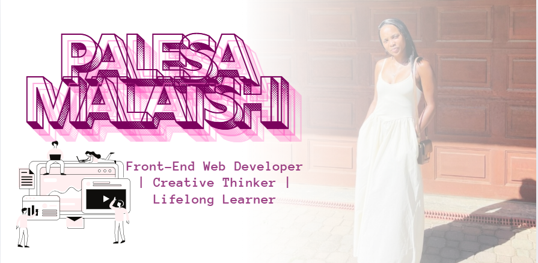

# 👋🏽 Hi, I’m Palesa Malatshi

> “The sky is not the limit — it’s just a view.” 🌌  
> Front-End Web Developer | Creative Thinker | Lifelong Learner

---

## 🌸 About Me

I'm a passionate front-end developer currently completing a full-time Software Development Bootcamp at CodeSpace Academy. I build responsive, inclusive, and memorable web experiences with a touch of flair and intention.

As a curious problem-solver, I’m always learning — from accessibility standards to design systems — blending code and creativity into everything I build. Whether it's face tracking apps, responsive UI components, or immersive layouts, I pour both logic and love into every pixel.

---

## 🌟 Pinned Project

(./assets/app.png")
<link url="https://face-tracker-app-pi.vercel.app/">

> 🎯 A visually immersive face tracking app built with a space-inspired aesthetic.  
> Features face tracking overlay, localStorage support, and responsive UI.

---

## 🔧 Skills & Tools

### 🧠 Core Languages
- HTML5, CSS3, JavaScript (ES6+)

### 🎨 Design & UI
- Figma
- Visual Hierarchy, Layout, Typography, Colour Theory
- Web Accessibility (WCAG, semantic HTML, ARIA roles)

### ⚒️ Frameworks & Libraries
- Bootstrap
- Tailwind CSS (learning)
- Laravel (back-end integration)

### 🌐 Web Development
- Responsive Design
- Git & GitHub
- DOM manipulation & LocalStorage

### 🧪 Tools & Projects
- Vercel (deployment)
- Live Server
- Scrimba (UI, Accessibility)
- A11Y Project & Google Learn Accessibility

---

## 🧩 Projects from Bootcamp

As part of my Software Development journey at CodeSpace, I’ve built:

- 🐾 [Instagram Pet Clone Page](https://github.com/palesamalatshi/pet-instagram-clone) – UI clone exercise focused on layout & structure.
- 🐱 [CodeSpace Cat Portfolio](https://github.com/palesamalatshi/codespace-cat) – Personal portfolio template project.
- 🧩 [Responsive Footer Component](https://github.com/palesamalatshi/PALMAL25525_FT02506_GroupA_Palesa-Malatshi_SDF04) – Flexbox + media query-based component.

---

## 📫 Contact Me

Let's collaborate or connect:

- 💼 [LinkedIn](https://www.linkedin.com/in/palesa-malatshi-945a702b6/)
- 🖥️ [GitHub](https://github.com/palesamalatshi)
- 🌍 Tsakane Ext 15, Johannesburg, South Africa
- ✉️ Email me via LinkedIn or on request

---

## 🌱 Currently Learning
- Tailwind CSS
- Advanced JavaScript (async, promises)
- Accessibility testing & best practices

---

_✨ Made with intention, style, and a dream bigger than the stars._

