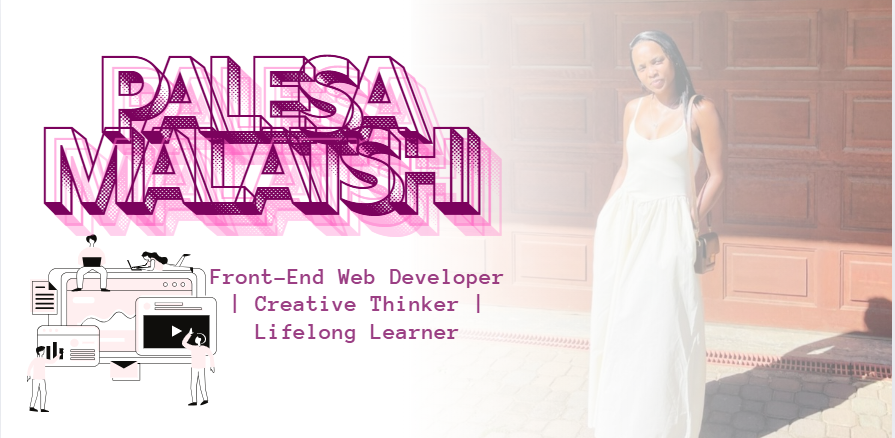
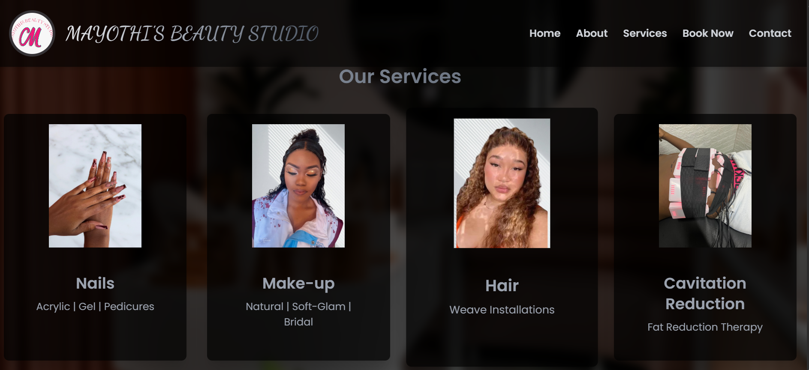
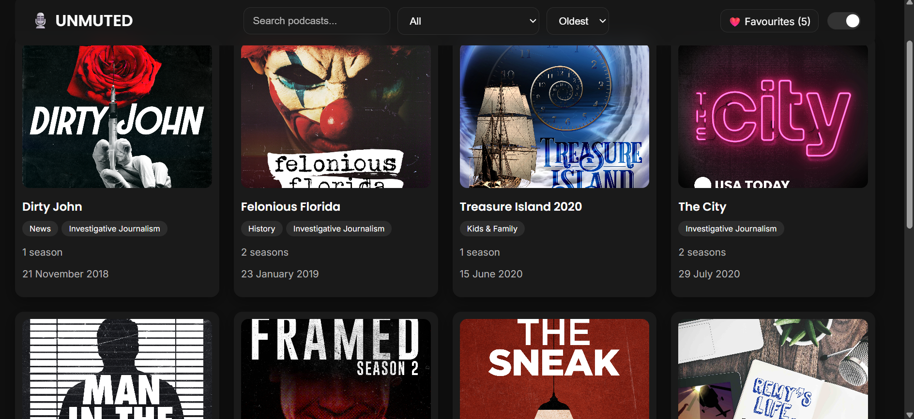
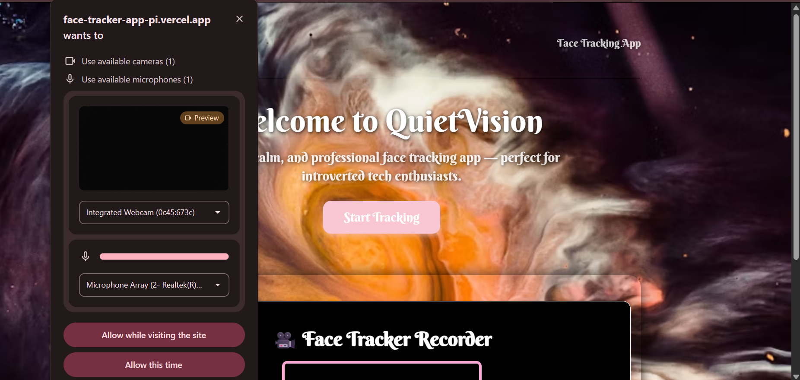
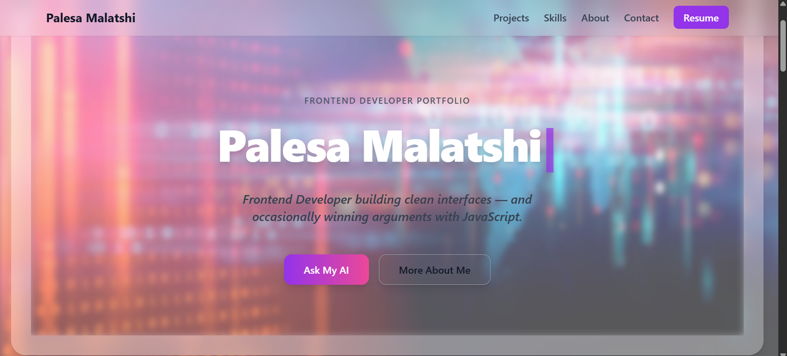

  

# 👋🏽 Hi, I'm Palesa Malatshi

### Front-End Developer | JavaScript • React • Responsive Web Applications

> *"The sky is not the limit — it's just a view."* 🌌

## 💜 About Me

A passionate **Front-End Developer** based in Gauteng, South Africa.

I recently graduated from **CodeSpace Academy's Software Development Programme**, where I built a strong foundation in modern web development using **JavaScript**, **React**, **HTML**, and **CSS**.

Outside of coding, I currently work as an **Administrative & Digital Support Assistant at Allied Builders Hardware**, where I support digital operations, website management, and business systems.

I enjoy creating digital experiences that are responsive, accessible, and solve real-world problems.

💜 I'm currently open to **Junior Front-End Developer**, **Web Developer**, and **Remote Software Development** opportunities.

---
## 🚀 Tech Stack

---

## 🌸 Mayothi Beauty Studio

A responsive website designed and developed for a real beauty business, featuring booking functionality, secure payments, and a modern mobile-first experience.

**Tech Stack**

HTML • CSS • JavaScript

---

## 🎙 Podcast Web Application

A responsive React application that allows users to browse podcasts, explore episodes, and enjoy audio playback through a clean, modern interface.

**Tech Stack**

React • CSS • JavaScript • React Router

---

## 🎥 Face Tracking Application

A browser-based face tracking application that explores real-time computer vision using JavaScript and browser APIs.

**Tech Stack**

Next.js • Tailwind CSS • JavaScript • face-api.js

---
## 🤖 Palesa AI Portfolio

A modern, interactive portfolio website that showcases my projects, technical skills, and professional journey as a Front-End Developer. The portfolio features an AI-powered assistant that allows recruiters and visitors to learn more about my experience, projects, and expertise through a conversational interface.

Designed with a strong focus on responsive design, accessibility, performance, and user experience, this portfolio reflects both my technical skills and my passion for creating engaging digital products.

**✨ Features**

- AI-powered portfolio assistant
- Interactive project showcase
- Responsive & mobile-first design
- Smooth animations and modern UI
- Skills & experience timeline
- Contact section with professional links

**🛠 Tech Stack**

React • JavaScript • Tailwind CSS • Vite • CSS

---

## 💼 Professional Experience

### 🏢 Administrative & Digital Support Assistant
**Allied Builders Hardware**  
*October 2025 – Present*

- Maintain and update the company website using OpenCart CMS
- Support digital operations and business systems
- Manage website content and product updates
- Assist with customer communication and administrative workflows

---

### 💻 Mobile Web Developer Intern (Remote)
**AdollarClass**  
*August 2025 – April 2026*

- Built responsive web components
- Collaborated remotely using GitHub
- Improved user interfaces and layouts
- Worked within a distributed development team

---

### 🚀 Freelance Front-End Developer
*2025 – Present*

- Developed responsive websites for small businesses
- Performed maintenance and troubleshooting
- Created modern, user-friendly web experiences

---

## 🌱 Current Focus

- Building production-ready React applications
- Writing cleaner, scalable JavaScript
- Improving accessibility (WCAG)
- Creating exceptional user experiences
- Contributing to open-source projects
---

## 📊 GitHub Analytics

---

# 🤝 Let's Connect

📧 **Email**

palesamalatshi22@gmail.com

💼 **LinkedIn**

https://www.linkedin.com/in/palesa-malatshi-945a702b6/

🌐 **Portfolio**

https://palesamalatshi.github.io/palesa-ai-portfolio/

💻 **GitHub**

https://github.com/palesamalatshi

📍 Kempton Park, Gauteng, South Africa

---

### 💜 A little about me

When I'm not coding, you'll probably find me learning something new, refining my portfolio, or exploring creative ways to combine design and technology.

I believe great software isn't just about writing code—it's about understanding people, solving meaningful problems, and never stopping the journey of learning.

⭐ Thanks for visiting my profile! If you like my work, feel free to explore my repositories or connect with me on LinkedIn.